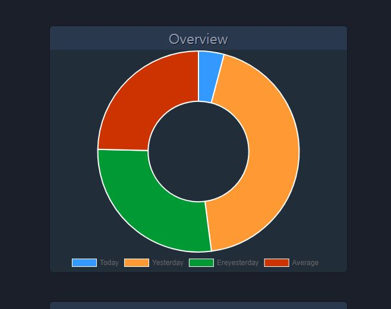
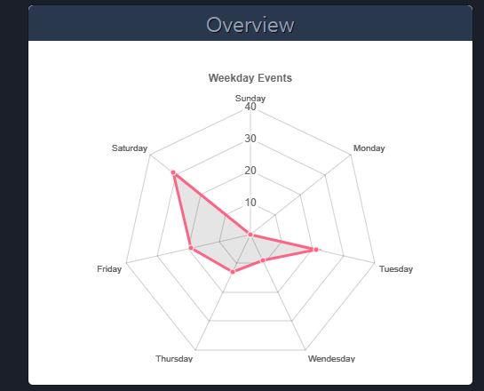

# Kerberos.IO
Open CCTV Software
Document about kerberos dockerfile, api and how to setting

# Sample Image

## Demo_Dashboard 

This webpage get dashboard graph and other thing from kerberos web server  
Each frames are made by using iframe tag

## Chart_Dashboard

Using CanvasJS, ChartJS, HeatmapJS to make this chart and image below

The data to make this can get by kerveros API

### Days

### Weekday

### Hours

### Heatmap

# Demo_Dashboard, Char_Dashboard

There is css, javascript, html files

